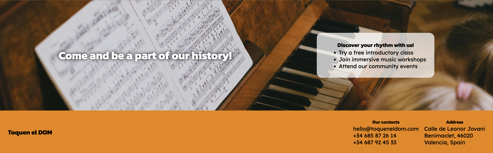
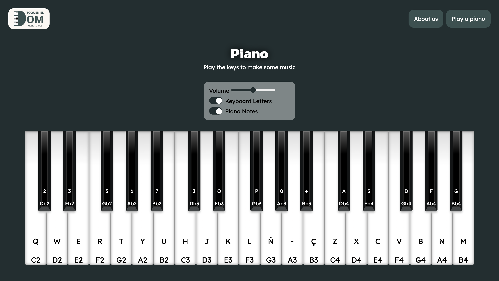

# toquen-el-dom

## Index

- [toquen-el-dom](#toquen-el-dom)
  - [Index](#index)
  - [About the project](#about-the-project)
  - [Main views of the project](#main-views-of-the-project)
    - [Colour scheme](#colour-scheme)
    - [Typography](#typography)
    - [Some views](#some-views)
  - [Features](#features)
    - [Navigation bar in header](#navigation-bar-in-header)
  - [Working environment](#working-environment)
    - [Tools](#tools)
    - [Methodologies](#methodologies)
  - [Installation](#installation)
    - [Download repository](#download-repository)
    - [Clone repository](#clone-repository)
    - [Execute with Docker](#execute-with-docker)
  - [Preview](#preview)
  - [Next steps](#next-steps)
  - [Authors](#authors)

## About the project

Toquen el DOM ("Play the DOM") is the interactive website for Escola de Música Benimaclet, a music school with over 35 years of history in Valencia, Spain. This project blends the school’s educational ethos with a playful experience: a virtual piano that users can play directly in their browser, using either their mouse or computer keyboard.

The website acts as a showcase for the school, highlighting its legacy and academic programs, while inviting visitors of all ages to explore music in an intuitive way. Perfect for prospective students, families, or music enthusiasts, it combines accessible design, interactivity, and a passion for music education

## Main views of the project

### Colour scheme

 

The website uses a palette of autumn colours that fit the warm wooden colors of instruments. The colour palette was taken from [color-hex](https://www.color-hex.com/) website.

### Typography

Google Fonts was used, it was choosen Kanit for titles and Lexend for the rest of the website. It was chosen as it looked clean and modern.

### Some views

 
 

 
  

## Features

Toquen el DOM offers a warm, modern, and accessible website featuring:
· A clean, autumn-inspired desing refleting the music school's identity.
· Easy navegation with a persistent menu linking to Home page and virtual piano.
· An interactive virtual paino playable via mouse or keyboard with realistic sounds.
· Respnsive layout for seamless use on desktop and mobile devices.

### Navigation bar in header

This website is comprised of two pages, all of them are accessible from the navigation menu. The navigation bar includes links from the logo of the web to the Home page, and links to each of the two pages, Home, Piano and is identical in each page to allow easy navigation.

The navigation bar is located in the upper right corner.

This section will allow the user to easily navigate from page to page across all devices without having to revert back to the previous page via the ‘back’ button. 

Desktop nav bar


## Working environment

### Tools

- CSS3 
- HTML5 
- JavaScript 
- Visual Studio Code 
- Docker 

### Methodologies

- GitFlow

## Installation


### Download repository
1. Download the ZIP from GitHub which contains all required files.
> [GitHub Toquen el DOM](https://github.com/sab-gif/toquen-el-dom)
2. Extract the ZIP file in your device.
3. Open the index.html file with your browser.

### Clone repository

> Requirement:
> - Install Git in your device.

1. Clone the repositoy from GitHub:
```
git clone https://github.com/sab-gif/toquen-el-dom
```
or
```
git clone git@github.com:sab-gif/toquen-el-dom.git
```
2. Open the index.html file with your browser.

### Execute with Docker

>Requirements:
> - Install Docker in your device.
> - Download or clone the repository.


1. Build an image from the Dockerfile.
```
docker build -t <image-name> -f Dockerfile .
```
2. Run the image to start the container.
```
docker run -p 8080:80 -name <image-name> <container-name>
```
3. Open in a browser the port 8080.

> [Open the port](http://127.0.0.1:8080/)


## Preview

<video alt="Piano video" src="assets/images-videos-readme/piano-preview.mp4" ></video>


## Next steps

1. Add more instruments
2. Add tutorials
3. Add a contact form
4. Add social media links

## Authors

- [Iris Sánchez](https://github.com/isanort)
- [Judit](https://github.com/J-uds)
- [Saba](https://github.com/sab-gif)
- [Thais Rocha](https://github.com/thaisrqueiroz) 